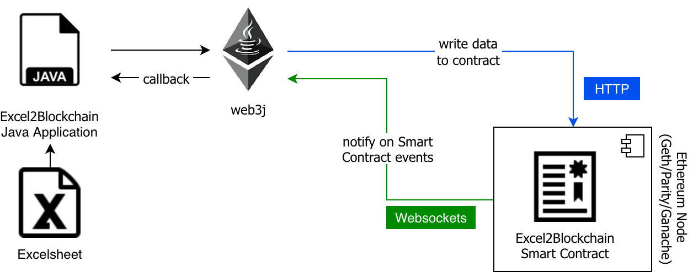

# Circles-Twitter-Trusthub

_Do not use this code in production (Mainnet) or any public testnets if you don't want your Excel data to be publicly readable by everyone! This is solely for training purposes._

# Prerequisites

* Ganache (or any other Ethereum Node or Infura)
* Java 11+
* Maven
* optional: Git

# Setup
Clone project with git clone or download the project as a compressed file

# Run
* Start Ganache with mnemonic `candy maple cake sugar pudding cream honey rich smooth crumble sweet treat`
* Build project with `mvn clean package`
* Change to directory target and start application with `java -jar safesig-0.0.1.jar`
