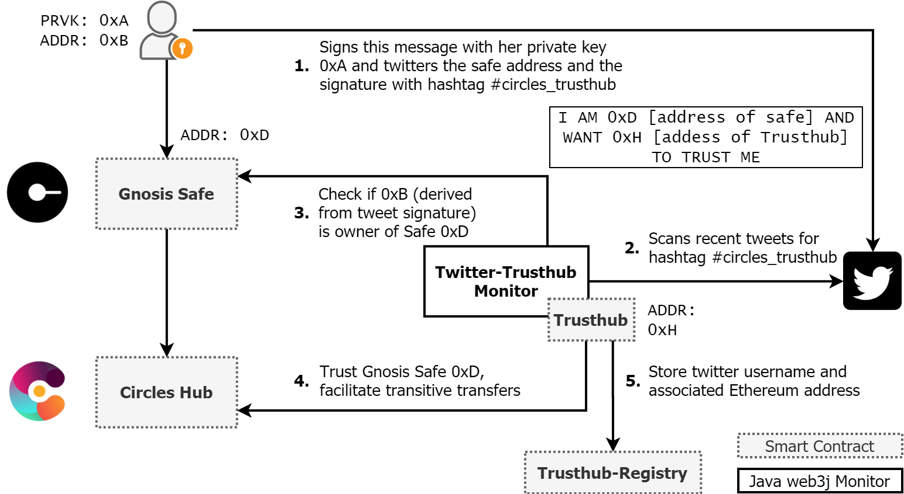

# Circles-Twitter-Trusthub

Implements a Circles account which gives trust to Circles users associated with verified Twitter accounts.

More info about the objective: ...

# Prerequisites

* Ganache (or any other Ethereum Node or Infura)
* Java 11+
* Maven
* optional: Git

# Setup
Clone project with git clone or download the project as a compressed file

# Run
* Start Ganache with mnemonic `candy maple cake sugar pudding cream honey rich smooth crumble sweet treat`
* Build project with `mvn clean package`
* Change to directory target and start application with `java -jar safesig-0.0.1.jar`
